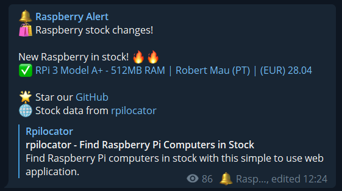

# Raspberry instock check bot

Get an alert on Telegram when there are Raspberry in stock ready to buy. This bot uses the website https://rpilocator.com/ to check for stock updates.

Join the Telegram channel to get notifications: https://t.me/raspberry_stock_alert



## Install

```sh
pnpm i
```

## Build

```sh
pnpm build
```

## Run

If omitted, `SEARCHED_RASPBERRY_MODELS` will watch all Raspberry models.

```sh
TELEGRAM_TOKEN=<telegram_bot_token> \
TELEGRAM_ADMIN_CHAT_ID=<telegram_chat_id_where_to_send_debug_info> \
TELEGRAM_CHAT_ID=<telegram_chat_id_where_to_send_alerts> \
USE_DIRECT_PRODUCT_LINK=1 \
SEARCHED_RASPBERRY_MODELS=RPI4-MODBP-4GB,RPI4-MODBP-8GB \
pnpm start
```

List of Raspberry models:

| Model (SKU)      | Description                            |
| ---------------- | -------------------------------------- |
| `CM4001000`      | RPi CM4 - 1GB RAM, No MMC, No Wifi     |
| `CM4001008`      | RPi CM4 - 1GB RAM, 8GB MMC, No Wifi    |
| `CM4001032`      | RPi CM4 - 1GB RAM, 32GB MMC, No Wifi   |
| `CM4002000`      | RPi CM4 - 2GB RAM, No MMC, No Wifi     |
| `CM4002008`      | RPi CM4 - 2GB RAM, 8GB MMC, No Wifi    |
| `CM4002016`      | RPi CM4 - 2GB RAM, 16GB MMC, No Wifi   |
| `CM4002032`      | RPi CM4 - 2GB RAM, 32GB MMC, No Wifi   |
| `CM4004000`      | RPi CM4 - 4GB RAM, No MMC, No Wifi     |
| `CM4004008`      | RPi CM4 - 4GB RAM, 8GB MMC, No Wifi    |
| `CM4004016`      | RPi CM4 - 4GB RAM, 16GB MMC, No Wifi   |
| `CM4004032`      | RPi CM4 - 4GB RAM, 32GB MMC, No Wifi   |
| `CM4008000`      | RPi CM4 - 8GB RAM, No MMC, No Wifi     |
| `CM4008008`      | RPi CM4 - 8GB RAM, 8GB MMC, No Wifi    |
| `CM4008016`      | RPi CM4 - 8GB RAM, 16GB MMC, No Wifi   |
| `CM4008032`      | RPi CM4 - 8GB RAM, 32GB MMC, No Wifi   |
| `CM4101000`      | RPi CM4 - 1GB RAM, No MMC, With Wifi   |
| `CM4101032`      | RPi CM4 - 1GB RAM, 32GB MMC, With Wifi |
| `CM4102000`      | RPi CM4 - 2GB RAM, No MMC, With Wifi   |
| `CM4102008`      | RPi CM4 - 2GB RAM, 8GB MMC, With Wifi  |
| `CM4102016`      | RPi CM4 - 2GB RAM, 16GB MMC, With Wifi |
| `CM4102032`      | RPi CM4 - 2GB RAM, 32GB MMC, With Wifi |
| `CM4104000`      | RPi CM4 - 4GB RAM, No MMC, With Wifi   |
| `CM4104008`      | RPi CM4 - 4GB RAM, 8GB MMC, With Wifi  |
| `CM4104016`      | RPi CM4 - 4GB RAM, 16GB MMC, With Wifi |
| `CM4104032`      | RPi CM4 - 4GB RAM, 32GB MMC, With Wifi |
| `CM4108000`      | RPi CM4 - 8GB RAM, No MMC, With Wifi   |
| `CM4108008`      | RPi CM4 - 8GB RAM, 8GB MMC, With Wifi  |
| `CM4108016`      | RPi CM4 - 8GB RAM, 16GB MMC, With Wifi |
| `CM4108032`      | RPi CM4 - 8GB RAM, 32GB MMC, With Wifi |
| `RPI4-MODBP-1GB` | RPi 4 Model B - 1GB RAM                |
| `RPI4-MODBP-2GB` | RPi 4 Model B - 2GB RAM                |
| `RPI4-MODBP-4GB` | RPi 4 Model B - 4GB RAM                |
| `RPI4-MODBP-8GB` | RPi 4 Model B - 8GB RAM                |
| `SC0510`         | Raspberry Pi Zero 2 W                  |

## License

```
           DO WHAT THE FUCK YOU WANT TO PUBLIC LICENSE
                   Version 2, December 2004

Copyright (C) 2022 rigwild <me@rigwild.dev> (https://rigwild.dev/)

Everyone is permitted to copy and distribute verbatim or modified
copies of this license document, and changing it is allowed as long
as the name is changed.

           DO WHAT THE FUCK YOU WANT TO PUBLIC LICENSE
  TERMS AND CONDITIONS FOR COPYING, DISTRIBUTION AND MODIFICATION

 0. You just DO WHAT THE FUCK YOU WANT TO.
```
